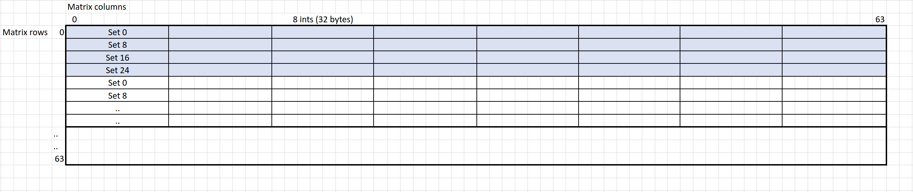
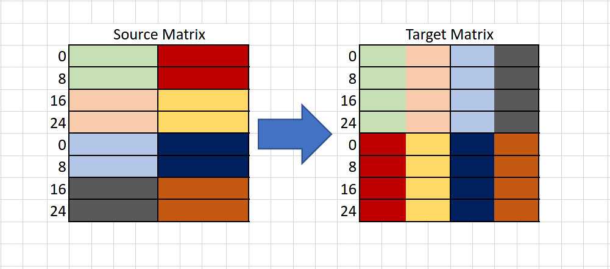
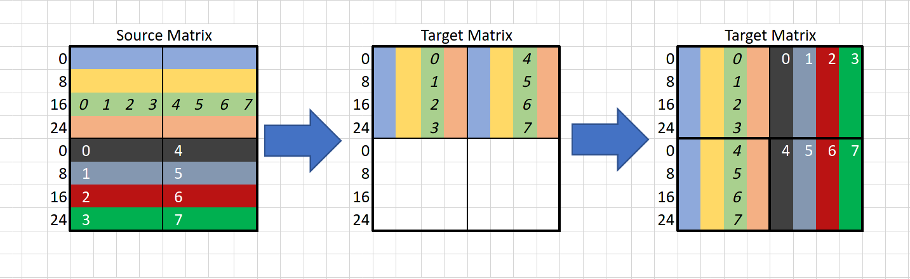
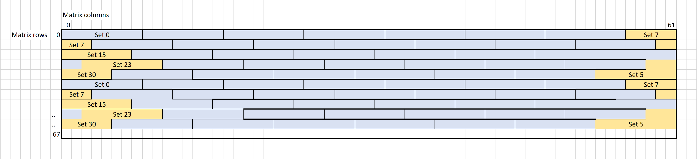

# Cache Lab

The code has typical homework quality.

## Cache Simulator

This was a relatively easy exercise, because we don't need to care about the blocks at all.
My solution passes the tests, although I wouldn't be surprised if there was an off-by-one error in there.

## Matrix Transposition

This was more interesting !

### 32 x 32

I was able to pass the 32 x 32 case easily just by tranpsposing 8 x 8 blocks at a time and unrolling to innermost loop.

### 64 x 64

This was harder. 
In the case of a 64 x 64 matrix, every 4 matrix rows overlap with one another in the cache,
unlike the 32 x 32 matrix, where each row of an 8 x 8 block gets its own cache set.

My instinct was to copy 2 x 4 blocks at a time like this:

This worked relatively well, but it wasn't optimal. 
I wasn't able to improve it on my own, so I found a better solution on the internet, which looks roughly like this:

### 67 x 61

The layout of a 67 x 61 matrix isn't aligned, which ironcially helps us in this case. 
The matrices are stored directly next to each other and the cache is a direct-mapped cache, 
so we don't have to worry about conflicts as much.

The solution here is to just copy N x N blocks at a time. I found that a block size of 14 works best, 
but I guess that 16 would be better in the real world.

